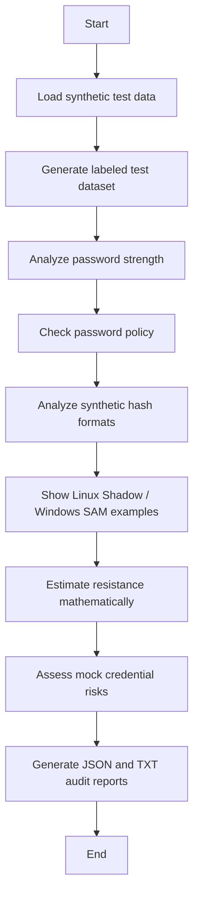

# Project workflow

```mermaid
flowchart TD
    A[Start] --> B[Load synthetic test data]
    B --> C[Generate labeled test dataset]
    C --> D[Analyze password strength]
    D --> E[Check password policy]
    E --> F[Analyze synthetic hash formats]
    F --> G[Show Linux Shadow / Windows SAM examples]
    G --> H[Estimate resistance mathematically]
    H --> I[Assess mock credential risks]
    I --> J[Generate JSON and TXT audit reports]
    J --> K[End]
```

All inputs are synthetic. No real credentials or authentication systems are accessed.
